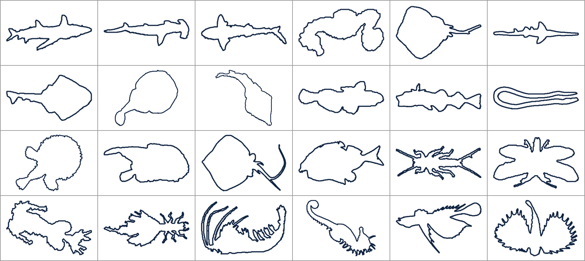
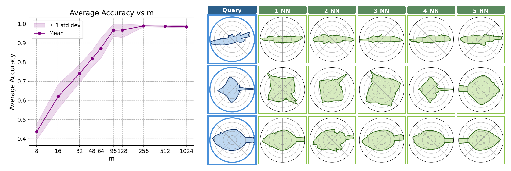
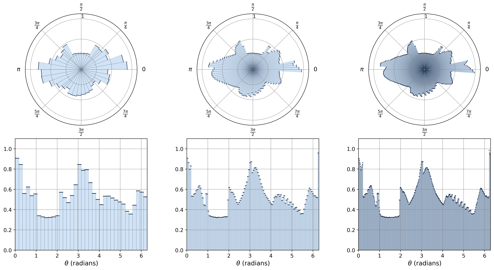
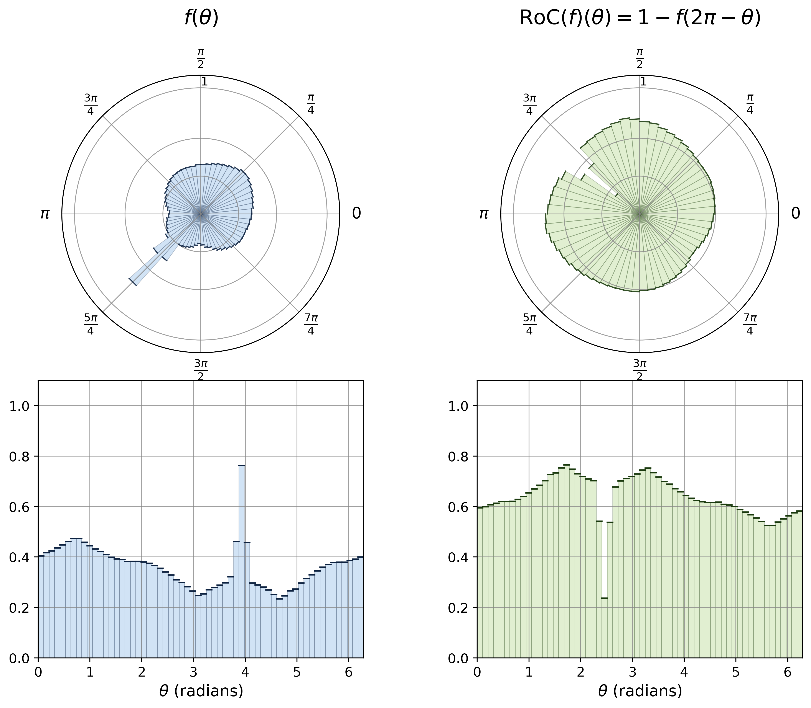

# Rotation-Invariant Vectorized Shape Representations &mdash; Star-Shaped Pipeline

A rotation-invariant vector representation of planar shapes built on top of the
SQUID fish dataset. Every shape is turned into a star-shaped radial function on
the discrete circle, then collapsed into a single signature vector whose
Euclidean distance is invariant to rotations of the underlying shape. With this
representation, clustering and nearest-neighbour search can run directly in
vector space &mdash; no per-shape alignment needed.

A separate `non-star` branch generalises the same idea to non-star objects via
an annulus decomposition.

---

## Repository layout

```
.
|-- data/
|   |-- SQUID/               raw SQUID dataset (1100 fish: .gif + .pts)
|   |-- ExtractedFromGifs/   boundary points + visualisations recovered from the .gif files
|   |                          (.pts and .png per shape; the pipeline reads from here)
|   `-- experiment_ids.json  fixed shape IDs used in the rotation and kNN experiments
|-- src/                     pipeline scripts
|-- figures/                 scripts that render headline figures
|-- docs/                    static images used in this README
`-- README.md
```

After running the pipeline the following files appear (all git-ignored):

- `data/combinedPts.json`, `data/combinedPtsNormalizedByArea.json` &mdash; cached vertex data
- `data/starShaped_signatures*ByArea.json`, `data/euclideanStarSignatures128ByArea.json` &mdash; cached signatures and pairwise distances
- `data/rotatedSampleByArea*.json` &mdash; the random-rotation collections used for clustering
- `figures/*.png`, `figures/*.pdf` &mdash; rendered figures
- `reports/knn_EuclideanStar/<query_id>/` &mdash; per-query 5-NN PNGs

Everything shipped in the repo is enough to regenerate them.

---

## Dataset

`data/SQUID/` is the upstream SQUID dataset (1100 fish outlines) of
Mokhtarian, Abbasi and Kittler. Each shape comes as a binary GIF plus a `.pts`
file with boundary samples.

`data/ExtractedFromGifs/` contains the same shapes after re-extracting their
boundaries from the GIFs (so the point ordering is consistent across the
dataset) along with a PNG preview per shape; the whole pipeline reads from
this folder.

A sample preprocessed shape:

<p align="center">
  
</p>

A 4x6 sample grid of fish from the dataset:

<p align="center">
  
</p>

---

## Signature

For a star-shaped function `f : Z_m -> R` (radial samples of a standardised
shape), the rotation-invariant signature is

```
V_f[k] = (1/m) * sum_{j=0..m-1} exp(-(f[j] - f[(j+k) mod m]))
```

which is a circular convolution of two pointwise exponentials and is therefore
computed in `O(m log m)` via the FFT (see `src/starShapedSignatureMaker.py`).
The Euclidean distance `||V_f - V_g||` is invariant to discrete rotations of
`f` as well as the Reverse-of-Complement operation `f -> M - f(2*pi - .)`.

---

## Pipeline

The numbered scripts are the ones you actually run; the others are helpers
imported / invoked by them.

| # | Script                                       | What it does                                                                                                                                                          |
|---|----------------------------------------------|-----------------------------------------------------------------------------------------------------------------------------------------------------------------------|
| 1 | `src/extractor.py`                           | Reads the raw `.gif` files, traces boundaries with OpenCV, and writes ordered `.pts` files into `data/ExtractedFromGifs/`.                                            |
| 2 | `src/combinePts.py`                          | Combines the per-shape `.pts` files into a single `data/combinedPts.json`.                                                                                            |
| 3 | `src/combinePtsNormalizeByArea.py`           | Translates each polygon so its area-weighted centroid is at the origin, then rescales so the maximum radius is 1. Writes `data/combinedPtsNormalizedByArea.json`.     |
| 4 | `src/draw.py`                                | (Optional) Renders a PNG preview of every `.pts` file in `data/ExtractedFromGifs/`.                                                                                   |
| 5 | `src/starShapedSignatureMaker.py`            | Approximates each polygon by a star-shaped function `f: S^m -> R+` and computes its FFT-based signature `V_f`. Writes `data/starShaped_signatures128ByArea.json`.     |
| 6 | `src/sampleRotatedVersion.py`                | Picks 10 random shape IDs, generates 9 random-rotation copies of each (100 shapes total), and writes one `data/rotatedSampleByArea*.json` file. Run multiple times to get multiple trials. |
| 7 | `src/euclideanOfStarSignatures.py`           | Computes the full 1100 x 1100 pairwise Euclidean distance matrix between signatures. Writes `data/euclideanStarSignatures128ByArea.json`.                             |
| 8 | `src/kmeansForStarShaped.py`                 | Simple stand-alone k-means clustering report on one rotated-sample file. Useful as a smoke test.                                                                      |
| 9 | `src/sign_kmeans_report.py`                  | Sweeps `m in {8,16,32,48,64,80,96,128,256,512,1024}` across every `data/rotatedSampleByArea*.json` file and appends per-trial accuracy rows to `figures/kmeans_results_per_file.csv`. |
| 10 | `src/sign_kmeans_reportFromCSV_with_std.py` | Reads the CSV produced by step 9 and renders the accuracy-vs-m plot with a +/- 1 std band (`figures/overall_accuracy_vs_ntheta_with_std.png`).                        |
| 11 | `src/knn_Euclidean.py`                      | 5-NN retrieval for the 10 fixed query IDs (see `data/experiment_ids.json`). Writes `reports/knn_EuclideanStar/<idx>/`.                                                |
| 12 | `src/resultOfReports.py`                    | Convenience report summariser used to inspect intermediate JSON outputs.                                                                                              |

### Headline figures

| Script                              | Output                                                | What it shows                                                            |
|-------------------------------------|-------------------------------------------------------|--------------------------------------------------------------------------|
| `figures/shape_table.py`            | `figures/shape_table_4x6.{png,pdf}`                   | A 4x6 grid of sample fish outlines from the dataset.                     |
| `figures/shape8_triple.py`          | `figures/kk102_triple_styled.{png,pdf}`               | The same fish at three discretisation levels (`m = 36, 120, 360`).       |
| `figures/shape8_styled.py`          | `figures/kk53_60_styled_COMBINED.{png,pdf}`           | Illustration of the Reverse-of-Complement operation on a single fish.    |
| `figures/knn_combined_figure.py`    | `figures/combined_knn_accuracy.png`                   | Side-by-side: clustering accuracy curve and a 5-NN retrieval gallery.    |

---

## Running everything

Tested with Python 3.13.

```bash
python3 -m venv venv && source venv/bin/activate
pip install -r requirements.txt
```

### One-shot preprocessing

If `data/ExtractedFromGifs/` is already populated (it ships with the repo) you
can skip step 1.

```bash
python3 src/extractor.py                  # GIF -> .pts (only needed once)
python3 src/combinePts.py                 # data/combinedPts.json
python3 src/combinePtsNormalizeByArea.py  # data/combinedPtsNormalizedByArea.json
python3 src/starShapedSignatureMaker.py   # data/starShaped_signatures128ByArea.json
python3 src/euclideanOfStarSignatures.py  # data/euclideanStarSignatures128ByArea.json
```

### Clustering experiment

```bash
# 6 independent trials (each samples 10 shapes + 9 random rotations each)
for i in 0 1 2 3 4 5; do python3 src/sampleRotatedVersion.py; done

python3 src/sign_kmeans_report.py                       # -> figures/kmeans_results_per_file.csv
python3 src/sign_kmeans_reportFromCSV_with_std.py       # -> figures/overall_accuracy_vs_ntheta_with_std.png
```

`sampleRotatedVersion.py` writes to `data/rotatedSampleByArea<N>.json`; the
exact shape IDs used in each trial are recorded in `data/experiment_ids.json`
if you want to reproduce them byte-for-byte.

### 5-NN search

```bash
python3 src/knn_Euclidean.py
python3 figures/knn_combined_figure.py
```

This writes `figures/combined_knn_accuracy.png`.

<p align="center">
  
</p>

### Other figures

```bash
python3 figures/shape8_triple.py
python3 figures/shape8_styled.py
python3 figures/shape_table.py
```

<p align="center">
  
</p>

<p align="center">
  
</p>

---

## Paper

This code accompanies the paper *Rotation-Invariant Vectorized Shape
Representations* by Hamid Shafieasl and Jeff M. Phillips, available on arXiv:
[https://arxiv.org/abs/2605.27498](https://arxiv.org/abs/2605.27498).

```bibtex
@misc{shafieasl2025rotation,
  author        = {Hamid Shafieasl and Jeff M. Phillips},
  title         = {Rotation-Invariant Vectorized Shape Representations},
  year          = {2025},
  eprint        = {2605.27498},
  archivePrefix = {arXiv},
  primaryClass  = {cs.CG},
  url           = {https://arxiv.org/abs/2605.27498}
}
```
