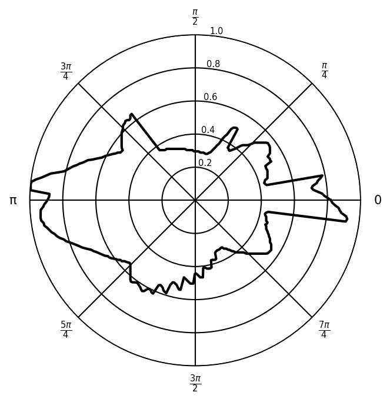
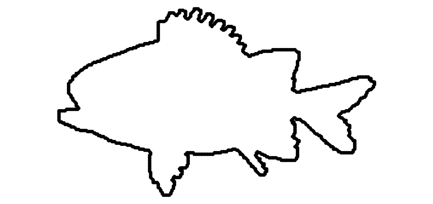

# Rotation-Invariant Vectorized Shape Representations &mdash; SQUID Experiments (Non-Star Branch)

Companion code to the paper
**_Rotation-Invariant Vectorized Shape Representations_**
by Hamid Shafieasl and Jeff M. Phillips.

This branch contains the **non-star (annulus) extension**. Instead of representing
each shape by a single radial function `f: S^m -> R` (which is only valid for
star-shaped objects), we slice every shape into `n` concentric annuli and build
a `0/1` indicator matrix `B in {0,1}^(n_sample x n)` where entry `B[j, i]` is
`1` iff the shape has any point in the `i`-th annulus and the `j`-th angular
wedge. The rotation-invariant signature is then computed column-wise on this
matrix and the columns are stacked into a single vector for downstream kNN /
clustering.

The corresponding **star-shaped** pipeline (which is the one the paper's
experiments use) lives on the `star` branch.

<p align="center">
  
</p>

---

## Repository layout

```
.
|-- data/
|   |-- SQUID/               # raw upstream SQUID dataset (1100 fish: .gif + .pts)
|   |-- ExtractedFromGifs/   # boundary points + visualisations recovered from the .gif files
|   `-- experiment_ids.json  # shape IDs used in the kNN demo
|-- src/                     # pipeline scripts (non-star + shared preprocessing)
|-- docs/                    # static images shown in this README
`-- README.md
```

After running the pipeline you will also see:

- `data/combinedPts.json`, `data/combinedPtsNormalizedByArea.json` &mdash; cached vertex data;
- `data/nonstarShaped_signatures128ByArea.json`, `data/euclideanNonStarSignatures128ByArea.json` &mdash; cached signatures and distances;
- `reports/knn_EuclideanNonStar/<query_id>/` &mdash; per-query 5-NN PNGs.

These outputs are git-ignored.

---

## Dataset

`data/SQUID/` is the upstream SQUID dataset (1100 fish, .gif + .pts pairs).
`data/ExtractedFromGifs/` contains the re-extracted boundaries (ordered .pts +
.png preview) that the whole pipeline reads.

A sample shape:

<p align="center">
  
</p>

---

## Signature: annulus matrix

For each shape `X` we set up `n` concentric annuli of radii `i/n -> (i+1)/n`
for `i = 0,..., n-1`. Inside each annulus we sample the angular indicator at
`n_sample` equally-spaced angles. This yields a matrix

```
B[j, i] = 1  if  X has a point in (i/n, (i+1)/n] x [j*2pi/n_sample, (j+1)*2pi/n_sample)
        = 0  otherwise.
```

Example (`n_sample = 5`, `n = 8`):

```
        0 0 0 0 0 0 0 0
        0 1 1 0 0 0 1 0
B   =   1 1 1 1 1 1 1 1
        1 0 1 1 1 1 0 1
        1 0 0 1 1 0 0 1
```

We then apply the same FFT-based rotation-invariant signature column by
column, and concatenate the columns into a single feature vector. The
Euclidean distance between these vectors gives a rotation-invariant
dissimilarity that also works for non-star objects.

---

## Pipeline

| # | Script                                 | What it does                                                                                                          |
|---|----------------------------------------|-----------------------------------------------------------------------------------------------------------------------|
| 1 | `src/extractor.py`                     | Reads raw `.gif` files, traces boundaries with OpenCV, writes ordered `.pts` files.                                   |
| 2 | `src/combinePts.py`                    | Combines per-shape `.pts` files into `data/combinedPts.json`.                                                         |
| 3 | `src/combinePtsNormalizeByArea.py`     | Centers each polygon at its area-weighted centroid and scales so max radius is 1; output `data/combinedPtsNormalizedByArea.json`. |
| 4 | `src/draw.py`                          | (Optional) Renders a PNG preview of every `.pts` file.                                                                |
| 5 | `src/nonstarShapedSignatureMaker.py`   | Builds the annulus indicator matrix per shape and computes the column-wise FFT signature.                             |
| 6 | `src/nonstar.py`                       | Stand-alone helper exposing the same annulus signature and a few weighted angular-distance variants.                  |
| 7 | `src/euclideanOfNonStarSignatures.py`  | Computes the 1100 x 1100 pairwise Euclidean distance matrix between non-star signatures.                              |
| 8 | `src/kmeansForNonStarShaped.py`        | Stand-alone k-means clustering report on non-star signatures.                                                         |
| 9 | `src/knn_EuclideanNonStar_5NN.py`      | 5-NN retrieval for the same 10 fixed query IDs used in the paper (see `data/experiment_ids.json`).                    |

---

## Quick start

```bash
python3 -m venv venv && source venv/bin/activate
pip install numpy scipy opencv-python Pillow shapely matplotlib scikit-learn

# 1) Preprocess (skip step 1 if data/ExtractedFromGifs/ is already there)
python3 src/extractor.py
python3 src/combinePts.py
python3 src/combinePtsNormalizeByArea.py

# 2) Build annulus signatures + distance matrix
python3 src/nonstarShapedSignatureMaker.py
python3 src/euclideanOfNonStarSignatures.py

# 3) 5-NN retrieval (writes reports/knn_EuclideanNonStar/<idx>/)
python3 src/knn_EuclideanNonStar_5NN.py
```

---

## Citation

If you build on this code, please cite the paper:

```
@unpublished{shafieasl2025rotation,
  author  = {Hamid Shafieasl and Jeff M. Phillips},
  title   = {Rotation-Invariant Vectorized Shape Representations},
  year    = {2025},
  note    = {Preprint}
}
```

The SQUID dataset is from Mokhtarian, Abbasi and Kittler (Curvature Scale
Space) and Nasreddine et al.; please cite the original sources as well.
